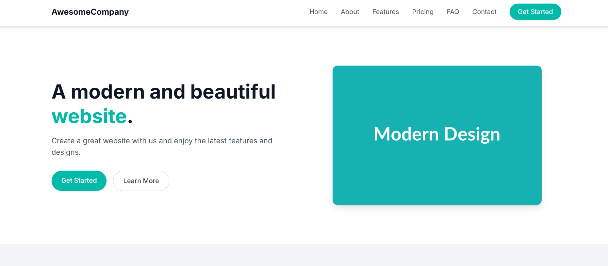
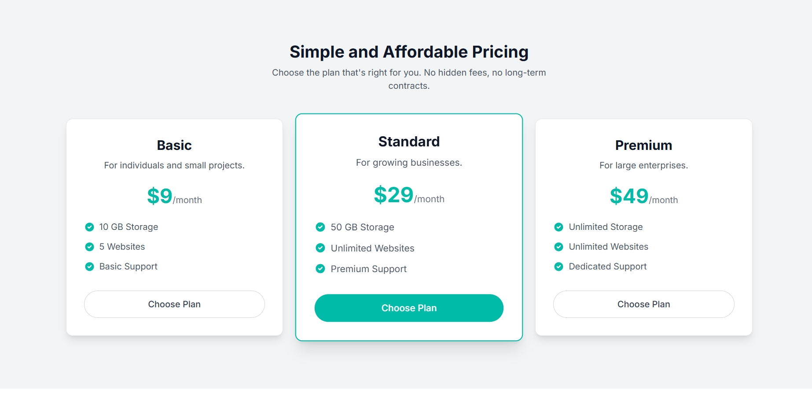
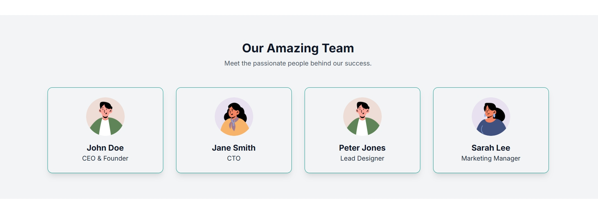

# AwesomeCompany
A brief but clear description of your project. Explain what it does, who it's for, and the main problem it solves.

## ✨ Screenshort




## 💻 Technologies Used
HTML5

CSS3

JavaScript

Tailwind CSS: For utility-first styling.

Angular (Standalone Components): For the front-end framework.

## 🛠️ Installation
Follow these steps to get the project up and running on your local machine.

Clone the repository:

git clone https://github.com/sachinksamad1/AwesomeCompany.git
cd AwesomeCompany

Install dependencies:
If you're using npm:
```
npm install
```
If you're using yarn:
```
yarn install
```
Run the application:
```
npm start
```
or
```
ng serve
```
The application will typically be available at http://localhost:4200.

## 🚀 Usage
Briefly explain how to use your application. Provide examples or screenshots if necessary.

## 🤝 Contributing
Contributions are what make the open-source community an amazing place to learn, inspire, and create. Any contributions you make are greatly appreciated.

Fork the Project

Create your Feature Branch (git checkout -b feature/AmazingFeature)

Commit your Changes (git commit -m 'Add some AmazingFeature')

Push to the Branch (git push origin feature/AmazingFeature)

Open a Pull Request

## 📜 License
Distributed under the MIT License. See [LICENSE](LICENSE) for more information.
